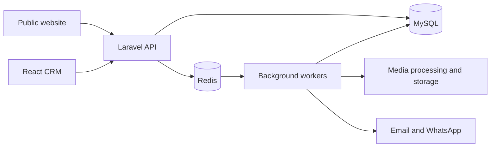

<div align="center">
  <h1>RH Nexus Events</h1>

  <p><strong>Public Website & Event Management CRM</strong></p>
  <p>Plan events, share progress, collect feedback, and publish completed work from one connected platform.</p>

  <p>
    
    
    
    
  </p>

  <p>
    <a href="#features">Features</a> ·
    <a href="#getting-started">Getting started</a> ·
    <a href="#configuration">Configuration</a> ·
    <a href="#testing">Testing</a> ·
    <a href="#deployment">Deployment</a>
  </p>
</div>

---

## Overview

RH Nexus Events combines a branded public website with a role-based CRM for administrators, managers, and clients. Both React applications share a Laravel API, MySQL database, and Redis-backed background processing.

Staff manage event stages, media, feedback, and public content through the CRM. Approved complimentary uploads automatically populate the website gallery, while client stage files remain private.

## Features

### Public website

- **Home:** Background films and an image-only event gallery.
- **Events:** Consistent thumbnail cards, hover-to-reveal video controls, and descriptions shown inside the opened video preview.
- **Team:** Profiles published directly from the administrator's CRM team section.
- **Forms:** Contact messages, meeting requests, and vendor applications saved to the backend.
- **Connected login:** CRM sign-in with website navigation and a return-to-website link.

### Event management CRM

- Event creation, client selection, and manager assignments.
- Multiple clients and managers per event.
- Stage updates with private images and videos.
- Additional stage files loaded in pages as the user scrolls, without file pagination controls.
- Simple client feedback and a final-result rating option.
- Complimentary image/video uploads with automatic public gallery publication.
- Persistent staff notifications for feedback and relevant website submissions.
- Account editing and password replacement; administrators can show or hide a newly entered password.
- Public team management, vendor review, and email/WhatsApp delivery status.


## ScreenShots


### Media and background workflows

- Server-side file validation and private original storage.
- ClamAV scanning, image optimization, video processing, and thumbnail generation.
- Authorized private downloads and background final-package preparation.
- Queued provider delivery, processing retries, and visible failure states.

## Roles and access

| Role | Responsibilities |
| --- | --- |
| **Administrator** | Manage accounts, events, assignments, website content, submissions, and delivery status. |
| **Manager** | Work on authorized events and clients, upload updates, and respond to feedback. |
| **Client** | View assigned events, access permitted media, and submit feedback or final ratings. |

Authorization is enforced by the Laravel backend. Existing passwords are hashed and are not returned to the browser. The account form's **View / Hide** button reveals only the replacement password being entered.

## Architecture



| Layer | Technology |
| --- | --- |
| Frontend | React, React Router, Vite |
| Backend | Laravel 12, session authentication, Sanctum CSRF endpoint |
| Data and queues | MySQL, Redis |
| Media | FFmpeg, ClamAV, WebP thumbnails |
| Operations | Ubuntu, Nginx, managed workers, encrypted restic backups |

## Repository structure

```text
.
├── website/                 # Public React website
│   ├── src/views/           # Individual website pages
│   ├── src/components/      # Gallery, navigation, forms, and shared UI
│   └── public/assets/       # Branding, styles, and public media
├── crm/                     # React event management application
│   ├── src/views/           # Accounts, events, notifications, and staff pages
│   └── src/components/      # Stages, uploads, feedback, and account forms
├── backend/                 # Laravel API
│   ├── app/                 # Controllers, validation, models, policies, and jobs
│   ├── database/            # Migrations and administrator bootstrap seeder
│   ├── routes/              # HTTP routes
│   └── tests/               # Backend feature tests
├── infrastructure/          # Nginx, PHP, worker, and scheduler templates
├── scripts/                 # Startup, build, verification, and release tools
└── test-results/             # Recorded test and performance evidence
```

Local `tools/` files belong to the prepared development environment. Private service configuration and database files should remain outside a published source package.

## Getting started

### Requirements

- PHP **8.3+** and Composer.
- Node.js **22.12+** and npm, satisfying both frontend projects.
- MySQL and Redis.
- FFmpeg and ClamAV with maintained signature databases for media processing.
- restic for the encrypted backup workflow.

### 1. Install dependencies

Run from the repository root:

```bash
cd backend
composer install
cd ../website
npm ci
cd ../crm
npm ci
cd ..
```

### 2. Configure a new environment

For a fresh checkout:

```bash
cp backend/.env.example backend/.env
```

Edit `backend/.env` with your database, Redis, media-tool, and application settings. The example file contains production defaults. For local development, set these values:

```dotenv
APP_ENV=local
APP_DEBUG=false
APP_URL=http://127.0.0.1:5173
WEBSITE_URL=http://127.0.0.1:5173
CRM_URL=http://127.0.0.1:5173/crm
SESSION_SECURE_COOKIE=false
```

Use the actual host, port, database name, and credentials of your MySQL and Redis services. Create the configured application database before migrating. Set `ADMIN_EMAIL` and a strong `ADMIN_PASSWORD` privately to bootstrap the first administrator.

### 3. Initialize the backend

For the newly configured environment:

```bash
cd backend
php artisan key:generate
php artisan migrate
php artisan db:seed
cd ..
```

The seeder creates the first administrator when none exists. Managers and clients are created through the CRM; no public demo passwords are included.

Keep the original `APP_KEY` when restoring an existing environment. It is needed to decrypt protected application data.

### 4. Run the application

Start MySQL and Redis, then run the following commands in separate terminals from the repository root:

| Process | Command |
| --- | --- |
| Laravel API | `cd backend && php -d upload_max_filesize=100M -d post_max_size=110M artisan serve --host=127.0.0.1 --port=8000` |
| Queue worker | `cd backend && php artisan queue:work redis --queue=media,notifications,default --tries=3 --timeout=1800 --sleep=2` |
| CRM | `cd crm && npm run dev` |
| Website | `cd website && npm run dev` |

| Application | Local URL |
| --- | --- |
| Website | <http://127.0.0.1:5173/> |
| CRM | <http://127.0.0.1:5173/crm/#/login> |

The website development server proxies `/api` and `/sanctum` to Laravel on port `8000`, and `/crm` to the CRM server on port `5175`. This keeps browser requests on the shared website origin.

<details>
<summary><strong>Using the prepared Ubuntu development package</strong></summary>

If the supplied private `tools/` environment and its configured database are already present, start the complete local application from the root:

```bash
bash scripts/start-local.sh
```

This uses the package's MySQL service on `3307`, Redis on `6380`, and the application ports above. Keep the terminal open and press **Ctrl+C** to stop its processes. Stop a previous application session before starting another.

This helper depends on the prepared local binaries and data; it is not a fresh-clone installer. Existing configured installations do not need their database seeded or their application key regenerated.

</details>

## Configuration

All credentials belong in server environment settings, not React source or this README. Start with [`backend/.env.example`](backend/.env.example).

| Area | Main environment variables |
| --- | --- |
| Application | `APP_URL`, `WEBSITE_URL`, `CRM_URL`, `APP_KEY` |
| Database | `DB_CONNECTION`, `DB_HOST`, `DB_PORT`, `DB_DATABASE`, `DB_USERNAME`, `DB_PASSWORD` |
| Redis | `REDIS_HOST`, `REDIS_PORT`, `REDIS_PASSWORD`, `CACHE_STORE`, `QUEUE_CONNECTION` |
| Sessions | `SESSION_DRIVER`, `SESSION_SECURE_COOKIE`, `SESSION_LIFETIME` |
| Media tools | `FFMPEG_BIN`, `CLAMSCAN_BIN`, `CLAMAV_DATABASE` |
| Company recipients | `COMPANY_EMAIL`, `COMPANY_WHATSAPP` |
| Backups | `MYSQL_BACKUP_CONFIG`, `RESTIC_BIN`, `RESTIC_REPOSITORY`, `RESTIC_PASSWORD_FILE` |

### Email

Configure `MAIL_MAILER`, `MAIL_HOST`, `MAIL_PORT`, `MAIL_SCHEME`, `MAIL_USERNAME`, `MAIL_PASSWORD`, and `MAIL_FROM_ADDRESS` for the chosen SMTP provider.

Contact messages queue email to the company address, with the visitor as Reply-To. Meeting requests also queue company email notifications.

### WhatsApp

Configure `WHATSAPP_TOKEN`, `WHATSAPP_PHONE_ID`, `WHATSAPP_API_VERSION`, `WHATSAPP_MEDIA_TEMPLATE`, `WHATSAPP_MEETING_TEMPLATE`, and `WHATSAPP_LANGUAGE` for the WhatsApp Business Platform.

Approved template variables must match the application:

| Template | Variables, in order |
| --- | --- |
| Media update | Event title; CRM event URL |
| Meeting request | Visitor name; phone; email; date/time; location; message |

Client media notifications require an assigned event, a valid WhatsApp number, and recorded consent. Provider credentials and approved templates are required for live sending. Until configured, deliveries remain **Pending configuration**.

Rebuild Laravel configuration and restart the running workers after changing server settings. The admin's **Email & WhatsApp** page shows delivery status. Provider acceptance is recorded as **Sent**; delivery/read webhooks are not implemented. Reconcile an **Uncertain** result with the provider before manually retrying.

## Publishing event media

1. Create an event, select its clients, and assign managers.
2. Add private stages and their files as work progresses.
3. In Complimentary, enter company name, event name, and location.
4. Upload the edited image and/or video intended for public display.
5. Wait for scanning and processing to mark the upload **Ready**.
6. Refresh the public gallery after its short cache expires.

Home gallery cards remain images only. Events cards show thumbnails without text beneath them; video controls appear on hover or keyboard focus. The edited image's Website description is shown below the opened video, with fallback to the video caption or event description. Ordinary stage media remains private.

Supported event uploads include JPEG, PNG, WebP, MP4, and WebM. The default limit is **100 MB per file**. PHP and Nginx request limits must match the application configuration. Private media and final packages require current event authorization before download.


## Testing

Run the verification script from the root:

```bash
bash scripts/verify.sh
```

It runs backend tests, Composer/npm audits, frontend validation tests, and production builds. Development Composer dependencies are required.

Individual checks:

```bash
# Backend: default PHPUnit configuration uses in-memory SQLite
cd backend
php vendor/bin/phpunit
composer audit

# Website
cd ../website
npm test
npm run build

# CRM
cd ../crm
npm test
npm run build
```

MySQL feature tests use [`backend/phpunit.mysql.xml`](backend/phpunit.mysql.xml) and a dedicated `rhnexus_test` database. Browser and workload scripts also require an isolated test environment. Run destructive fixture setup only against test databases.

Recorded reports are in [`test-results/`](test-results/). Recent local UI checks covered event previews, all three roles, stage media across multiple pages, favicon responses, and admin password visibility. Passing local checks does not establish production performance or security acceptance.

## Deployment

Build the React applications and install production backend dependencies:

```bash
bash scripts/build.sh
```

This script uses `composer install --no-dev`; retain a separate development environment for testing. Serve `website/dist/` and `crm/dist/`, with Laravel behind PHP-FPM.

Production setup should include:

- HTTPS, `APP_ENV=production`, `APP_DEBUG=false`, and Secure session cookies.
- Protected environment files, private storage, and least-privilege service/database users.
- Managed media, notification, and default queue workers.
- Maintained ClamAV signatures and configured media tools.
- Laravel configuration/route caching and worker restarts after releases.
- Scheduled encrypted backups, monitoring, and rehearsed restoration.

Adapt the examples in [`infrastructure/`](infrastructure/) to the actual domain and server. [`scripts/deploy.sh`](scripts/deploy.sh) and [`scripts/rollback.sh`](scripts/rollback.sh) are release templates, not ready-made hosting configuration. Take a backup before release changes and retain a compatible previous release.

### Health and backups

```bash
cd backend
php artisan nexus:health
php artisan nexus:backup
```

The scheduler examples support recurring backups and maintenance. The local startup script does not install a system scheduler. Restore backups into a separate environment first and preserve the original application encryption key.

## Project status

Website/CRM integration and the described UI workflows are implemented and have local verification evidence. Production acceptance remains open for real email/WhatsApp delivery, HTTPS deployment, managed workers, scheduled backup restoration, and representative performance measurements.

Do not publish environment secrets, private business media, local credentials, service data, or backup passwords with the repository.

---

<div align="center">
  <strong>RH Nexus Events</strong><br />
  Connect. Create. Celebrate.<br /><br />
  <a href="mailto:rhnexusevents@gmail.com">rhnexusevents@gmail.com</a> · 03712250420
</div>
